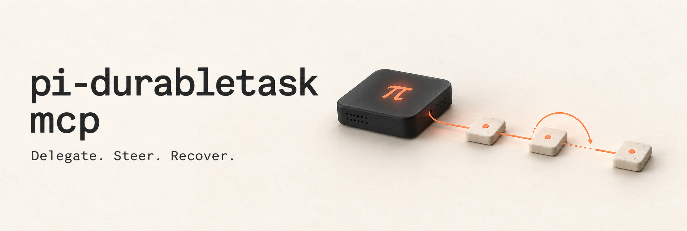

<p align="center">
  
</p>

<div align="center">

**English** · [简体中文](README.zh-CN.md)

**Pi agents for Claude Code, Codex, and any MCP client.**

Background tasks · Live steering · Opt-in SQLite recovery · Native Pi MCP

[](https://github.com/Nyarlathoteppppp/pi-durabletask-mcp/actions/workflows/ci.yml)
[](package.json)
[](LICENSE)

[Get started](#quick-start) · [Features](#key-features) · [Reference](docs/reference.md)

</div>

## Give Pi the task.

Your agent delegates to [Pi Coding Agent](https://pi.dev), checks progress, and collects
the result. Steer live work or follow up in the same conversation.

| Delegate | Steer | Recover |
| :--- | :--- | :--- |
| One task or a batch, in the background. | Redirect work in progress. | Resume after a restart with `durable: true`. |

## Quick start

**Requires Node.js 22.19+ and Pi 1.0.0.** Search uses Pi's downloaded `rg` or ripgrep on PATH.

### 1 · Install

```bash
npm install -g @earendil-works/pi-coding-agent@1.0.0
pi  # configure a provider or use /login

git clone https://github.com/Nyarlathoteppppp/pi-durabletask-mcp.git
cd pi-durabletask-mcp
npm ci
npm run build
```

### 2 · Connect

Replace `/absolute/path/pi-durabletask-mcp` with your checkout path.

**Claude Code**

```bash
claude mcp add --scope user pi -- node /absolute/path/pi-durabletask-mcp/dist/index.js
```

**Codex** — add to `~/.codex/config.toml`:

```toml
[mcp_servers.pi]
command = "node"
args = ["/absolute/path/pi-durabletask-mcp/dist/index.js"]
```

Already connected? Update the existing entry and reconnect the MCP server.
[Other clients →](docs/reference.md#other-mcp-clients)

### 3 · Delegate

> Use Pi to review this repository and report the findings.

Your agent calls `init` → `spawn` → `wait` / `status`. Pi uses your configured model and
**read-only tools** by default. [Models & permissions →](docs/reference.md#configuration)

## Usage

For a task that should recover after a bridge restart, ask for a **durable task**, or pass:

```json
{
  "cwd": "/absolute/path/to/repo",
  "prompt": "Review this repository and report the findings.",
  "durable": true
}
```

<details>
<summary><strong>All 13 tools</strong></summary>

| Want to… | Use |
| :--- | :--- |
| Start work | `spawn` · `spawn_batch` · `run` |
| Check progress | `status` · `wait` · `sessions` |
| Redirect or continue | `steer` · `follow_up` |
| Answer, stop, or remove | `answer` · `abort` · `forget` |
| Discover configuration | `init` · `models` |

</details>

Delegates can also use selected **Pi native MCP servers** with an explicit tool allowlist.
[Native MCP setup →](docs/reference.md#native-mcp)

## Key features

- **Stay in control.** Run parallel delegates with `spawn_batch`, steer active work, and use `follow_up` to continue the same conversation.
- **One owner per durable task.** Kernel-released SQLite locks let crashed owners' work recover without relying on PID identity or allowing two executors to claim it.
- **Native Pi MCP.** Choose servers and exact tool permissions per delegate, including `codemode` and `tool_search`. Third-party extensions are a separate opt-in.
- **Small polling responses.** `status` / `wait` show the latest five tool calls and the total count. Use `verbose: true` for the full trace.
- **Budgets and retention.** Set turn and time limits. Durable history defaults to seven days; `retentionDays` customizes it, and storage pressure can remove finished history earlier.
- **Your Pi setup.** Reuse your global Pi SDK and provider configuration; choose a model for each delegate. Provider retries are visible in status notices.

[Configuration →](docs/reference.md#configuration) · [Ownership & retention →](docs/reference.md#ownership)

## What recovery means

Tasks are **in memory by default**. With `durable: true`, SQLite saves history, tool results,
and pending steering. Unfinished tasks recover on restart; finished history stays until
retention removes it.

Interrupted tools can have **unknown outcomes**. The bridge does not blindly replay their
side effects; inspect external state before retrying. Original deadlines include downtime.
[Recovery & retention →](docs/reference.md#recovery-after-a-server-restart)

<details>
<summary><strong>Updating Pi</strong></summary>

After `pi update --all`, run `npm test` in this checkout, then reconnect the MCP server.
The bridge shares your global Pi SDK; Pi Durable stays pinned separately.

</details>

---

<div align="center">

[Reference](docs/reference.md) · [Development](docs/reference.md#development) · [Changelog](CHANGELOG.md) · [Issues](https://github.com/Nyarlathoteppppp/pi-durabletask-mcp/issues)

[MIT](LICENSE) · Built on [howznguyen/pi-delegate-mcp](https://github.com/howznguyen/pi-delegate-mcp) and Pi Durable.

</div>
